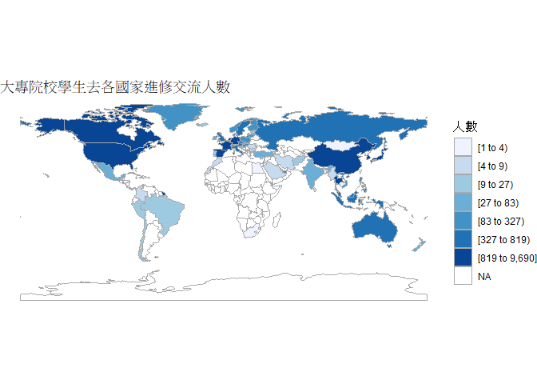

108-2 大數據分析方法 作業二
================
劉依婷 B0644222

作業完整說明[連結](https://docs.google.com/document/d/1aLGSsGXhgOVgwzSg9JdaNz2qGPQJSoupDAQownkGf_I/edit?usp=sharing)

學習再也不限定在自己出生的國家，台灣每年有許多學生選擇就讀國外的大專院校，同時也有人多國外的學生來台灣就讀，透過分析大專校院境外學生人數統計、大專校院本國學生出國進修交流數、世界各主要國家之我國留學生人數統計表可以了解各大專院校國際交流的情形。請同學分析以下議題，並以視覺化的方式呈現分析結果，呈現105-107年以後大專院校國際交流的情形
(如提供網址資料有缺少年份，可嘗試自己google一下需要年份的資料)。

## 來台境外生分析

### 資料匯入與處理

``` r
library(readr)
library(dplyr)
country_come_tw105<- read_csv("105_a.2.csv")
country_come_tw106<- read_csv("106_a.2.csv")
country_come_tw107<- read_csv("107_a.2.csv")
country_come_tw107$國別<-gsub("史瓦帝尼王國","史瓦濟蘭",country_come_tw107$國別)
country_come_tw105$國別<-gsub("索馬利亞民主共和國","索馬利亞",country_come_tw105$國別)
country_come_tw106$國別<-gsub("索馬利亞民主共和國","索馬利亞",country_come_tw106$國別)
country_come_tw107$國別<-gsub("索馬利亞民主共和國","索馬利亞",country_come_tw107$國別)
country_come_tw105$國別<-gsub("馬其頓","北馬其頓共和國",country_come_tw105$國別)
country_come_tw106$國別<-gsub("馬其頓","北馬其頓共和國",country_come_tw106$國別)
country_come_tw105$國別<-gsub("中國大陸","大陸地區",country_come_tw105$國別)

country_come_tw1<-
  full_join(country_come_tw105,country_come_tw106,by="國別")
country_come_tw<-
  full_join(country_come_tw1,country_come_tw107,by="國別")
country_come_tw <- 
  subset(country_come_tw, select = c(-洲別.y, -洲別))

foreigner_number105<- read_csv("105_a.1.csv")
foreigner_number106<- read_csv("106_a.1.csv")
foreigner_number107<- read_csv("107_a.1.csv")

foreigner_number105$學校名稱<-
  gsub("德霖技術學院","宏國德霖科技大學",foreigner_number105$學校名稱)
foreigner_number105$學校名稱<-
  gsub("東方設計學院","東方設計大學",foreigner_number105$學校名稱)
foreigner_number105$學校名稱<-
  gsub("崇右技術學院","崇右影藝科技大學",foreigner_number105$學校名稱)
foreigner_number105$學校名稱<-
  gsub("台北海洋技術學院","台北海洋科技大學",foreigner_number105$學校名稱)

foreigner_number1<-
  full_join(foreigner_number105,foreigner_number106,by="學校名稱")
foreigner_number<-
  full_join(foreigner_number1,foreigner_number107,by="學校名稱")

foreigner_number<- 
  subset(foreigner_number, 
         select = c(-學校類型.y,-學校代碼.y,-學校類型,-學校代碼))
```

### 哪些國家來台灣唸書的學生最多呢？

``` r
library(knitr)
country<-
  country_come_tw[head(order(rowSums(country_come_tw[ ,3:29],na.rm = TRUE),decreasing = TRUE),10),2]
number<-
  head(sort(rowSums(country_come_tw[ ,3:29],na.rm = TRUE),decreasing = TRUE),10)
country_number<-
  data.frame("國別"=country,
             "總人數"=number)
kable(country_number)
```

| 國別   |  總人數   |
| :--- | :----: |
| 大陸地區 | 107245 |
| 馬來西亞 | 50771  |
| 越南   | 27895  |
| 香港   | 25720  |
| 日本   | 25690  |
| 印尼   | 24243  |
| 澳門   | 15141  |
| 南韓   | 13441  |
| 美國   | 11385  |
| 泰國   |  8195  |

### 哪間大學的境外生最多呢？

``` r
foreigner_number<-filter(foreigner_number,學校名稱!="無法區分校別")

library(knitr)
college<-
  foreigner_number[head(order(rowSums(foreigner_number[ ,4:30],na.rm = TRUE),decreasing = TRUE),10),3]
number<-
  head(sort(rowSums(foreigner_number[ ,4:30],na.rm = TRUE),decreasing = TRUE),10)
college_number<-
  data.frame("學校名稱"=college,
             "總人數"=number)
kable(college_number)
```

| 學校名稱     |  總人數  |
| :------- | :---: |
| 國立臺灣師範大學 | 18501 |
| 國立臺灣大學   | 14502 |
| 銘傳大學     | 12120 |
| 淡江大學     | 11903 |
| 中國文化大學   | 11139 |
| 國立成功大學   | 9409  |
| 國立政治大學   | 9020  |
| 逢甲大學     | 8016  |
| 中原大學     | 8003  |
| 輔仁大學     | 7143  |

### 各個國家來台灣唸書的學生人數長條圖

``` r
all_country<-
  country_come_tw[order(rowSums(country_come_tw[ ,3:29],na.rm = TRUE),decreasing = TRUE),2]
all_number<-
  sort(rowSums(country_come_tw[ ,3:29],na.rm = TRUE),decreasing = TRUE)
all_c_n<-
  data.frame("國別"=all_country,"總人數"=all_number)

library(ggplot2)
ggplot()+
  theme(axis.text.x = element_text(face="bold",angle=90,hjust=1,vjust=0.5))+
  theme(plot.title=element_text(hjust = 0.5,face="bold",size=20,family = "A",color =4 ))+
  geom_bar(data=all_c_n,aes(x=國別,y=總人數),
           stat="identity")+
  labs(x="國家名稱",y="來台名稱",title="各個國家來台灣唸書的學生人數")
```

<!-- -->

### 各個國家來台灣唸書的學生人數面量圖

``` r
library(choroplethr)
library(choroplethrMaps)
library(readxl)
library(tidyr)
library(ggplot2)

CountryName<- read_excel("Q3fk.xls")
colnames(CountryName)[3]<-"國家別"
CountryName <- CountryName %>%
  rbind(c("亞太","中國人民共和國","大陸地區","Republic of China","China"),
        c("亞太","香港","香港","Hong Kong","Hong Kong"),
        c("亞太","澳門","澳門","Macao","Macao"),
        c("美洲","波多黎各","波多黎各","Puerto Rico","Puerto Rico"),
        c("非洲","索馬利蘭","索馬利蘭","Somaliland","Somaliland"),
        c("中東","巴勒斯坦","巴勒斯坦","Palestine","Palesting"))
CountryName$國家別 <-gsub("澳大利亞、澳洲","澳大利亞",CountryName$國家別)
CountryName$國家別 <-gsub("史瓦帝尼王國","史瓦濟蘭」）",CountryName$國家別)
CountryName$國家別 <-gsub("巴布亞紐幾內亞、巴紐","巴布亞紐幾內亞",CountryName$國家別)
CountryName$國家別 <-gsub("韓國、南韓","南韓",CountryName$國家別)
CountryName$國家別 <-gsub("史瓦帝尼（原「史瓦濟蘭」）","史瓦濟蘭",CountryName$國家別)
CountryName$國家別 <-gsub("波士尼亞","波士尼亞與赫塞哥維納",CountryName$國家別)
CountryName$國家別 <-gsub("阿聯","阿拉伯聯合大公國",CountryName$國家別)
CountryName$國家別 <-gsub("民主剛果","剛果民主",CountryName$國家別)
CountryName$國家別 <-gsub("沙烏地阿拉伯、沙烏地","沙烏地阿拉伯",CountryName$國家別)
CountryName$國家別 <-gsub("聖多美","聖多美普林西比",CountryName$國家別)
CountryName$國家別 <-gsub("聖文森國","聖文森",CountryName$國家別)
CountryName$國家別 <-gsub("北馬其頓共和國","北馬其頓",CountryName$國家別)

all_c_n_df <- data.frame(國家別= all_c_n$國別,value=all_c_n$總人數 )
all_c_n_df$國家別<-gsub("共和國|群島","",all_c_n_df$國家別)
all_c_nChoro<-left_join(all_c_n_df,CountryName,by="國家別")
all_c_nChoro$英文國名簡稱<-gsub("-","",all_c_nChoro$英文國名簡稱)
all_c_nChoro$英文國名簡稱<-gsub("U.S.A.、US","united states of america",all_c_nChoro$英文國名簡稱)
all_c_nChoro$英文國名簡稱<-gsub("United Kingdom、UK","united kingdom",all_c_nChoro$英文國名簡稱)
all_c_nChoro$英文國名簡稱<-gsub("North Macedonia","macedonia",all_c_nChoro$英文國名簡稱)
all_c_nChoro$英文國名簡稱<-gsub("ROK、South Korea","south korea",all_c_nChoro$英文國名簡稱)
all_c_nChoro$英文國名簡稱<-gsub("Papua New Guinea、PNG","Papua New Guinea",all_c_nChoro$英文國名簡稱)
all_c_nChoro$英文國名簡稱<-gsub("Serbia","republic of serbia",all_c_nChoro$英文國名簡稱)
all_c_nChoro$英文國名簡稱<-gsub("Tanzania","united republic of tanzania",all_c_nChoro$英文國名簡稱)
all_c_nChoro$英文國名簡稱<-gsub("Bahamas","The Bahamas",all_c_nChoro$英文國名簡稱)
all_c_nChoro$英文國名簡稱<-gsub("czechia","czech republic",all_c_nChoro$英文國名簡稱)
all_c_nChoro$英文國名簡稱<-gsub("UAE","united arab emirates",all_c_nChoro$英文國名簡稱)
all_c_nChoro$英文國名簡稱<-gsub("Japan、Nippon","japan",all_c_nChoro$英文國名簡稱)
all_c_nChoro$英文國名簡稱<-gsub("Central African","central african republic",all_c_nChoro$英文國名簡稱)
all_c_nChoro$英文國名簡稱<-gsub("Eswatini","swaziland",all_c_nChoro$英文國名簡稱)
all_c_nChoro$英文國名簡稱<-gsub("Cote d'Ivoire","ivory coast",all_c_nChoro$英文國名簡稱)
all_c_nChoro$英文國名簡稱<-gsub("Czechia","czech republic",all_c_nChoro$英文國名簡稱)
all_c_nChoro$英文國名簡稱<-gsub("East Timor、Timor-Leste","east timor",all_c_nChoro$英文國名簡稱)
all_c_nChoro$英文國名簡稱<-gsub("DRC、Democratic Republic of Congo","democratic repubic of the congo",all_c_nChoro$英文國名簡稱)
all_c_nChoro[[6]]<-tolower(all_c_nChoro[[6]])
colnames(all_c_nChoro)[6] <-"region"
all_c_nChoro %>%
  filter(!is.na(region)) %>%
  country_choropleth()+
  scale_fill_brewer(palette = "Blues")+
  labs(title="各個國家來台念書的學生人數分布圖",
       fill="人數")
```

<!-- -->

## 台灣學生國際交流分析

### 資料匯入與處理

``` r
library(readr)
library(dplyr)
library(tidyr)
library(knitr)

X105_106_107 <- read_csv("105.106.107.csv")
```

### 台灣大專院校的學生最喜歡去哪些國家進修交流呢？

``` r
X105_106_107Country<- X105_106_107 %>% 
  select(`進修交流國家(地區)別`,`本國學生出國進修交流至少1學期(修讀學分)以上人數小計`,`本國學生出國進修交流未滿1學期(修讀學分)人數小計`) %>%
  gather(交流時間,出國進修人數,-`進修交流國家(地區)別`) %>%
  group_by(`進修交流國家(地區)別`) %>%
  summarise(value=sum(出國進修人數,na.rm=T)) %>%
  arrange(desc(value))
X105_106_107Country %>%
  head(10)%>%
  kable()
```

| 進修交流國家(地區)別 | value |
| :---------- | ----: |
| 大陸地區        |  9690 |
| 日本          |  8813 |
| 美國          |  4366 |
| 大韓民國(南韓)    |  4150 |
| 德意志聯邦共和國    |  2943 |
| 法國          |  2037 |
| 西班牙王國       |  1364 |
| 加拿大         |   951 |
| 泰國          |   924 |
| 荷蘭王國        |   819 |

### 哪間大學的出國交流學生數最多呢？

``` r
X105_106_107School <- X105_106_107 %>% 
  select(學校名稱,`本國學生出國進修交流至少1學期(修讀學分)以上人數小計`,`本國學生出國進修交流未滿1學期(修讀學分)人數小計`) %>%
  gather(交流時間,出國進修人數,-學校名稱) %>%
  group_by(學校名稱) %>%
  summarise(value=sum(出國進修人數,na.rm=T)) %>%
  arrange(desc(value))
X105_106_107School %>%
  head(10)%>%
  kable()
```

| 學校名稱   | value |
| :----- | ----: |
| 國立臺灣大學 |  3657 |
| 淡江大學   |  3271 |
| 國立政治大學 |  2804 |
| 靜宜大學   |  1529 |
| 輔仁大學   |  1383 |
| 逢甲大學   |  1368 |
| 中國文化大學 |  1302 |
| 東吳大學   |  1262 |
| 國立交通大學 |  1150 |
| 東海大學   |  1054 |

### 台灣大專院校的學生最喜歡去哪些國家進修交流條狀圖

``` r
library(ggplot2)
ggplot()+
  theme_classic()+
  theme(axis.text.x = element_text(angle=90,hjust=1,vjust=0.5))+
  theme(plot.title=element_text(hjust = 0.5,face="bold",size=15,family = "A",color = 2))+
  geom_bar(data=X105_106_107Country,aes(x=`進修交流國家(地區)別`,y=value),
           stat="identity")+
  labs(x="國家名稱",y="人數",title="台灣大專院校學生去各國家進修交流人數")
```

<!-- -->

### 台灣大專院校的學生最喜歡去哪些國家進修交流面量圖

``` r
library(choroplethr)
library(choroplethrMaps)
library(readxl)
library(tidyr)
library(ggplot2)
library(dplyr)

X105_106_107Country$`進修交流國家(地區)別`<-gsub("大韓民國[(]南韓[)]","南韓",X105_106_107Country$`進修交流國家(地區)別`)
X105_106_107Country$`進修交流國家(地區)別`<-gsub("聯邦|共和國|合眾國|和平之國|伊斯蘭|侯國","",X105_106_107Country$`進修交流國家(地區)別`)
X105_106_107Country$`進修交流國家(地區)別`<-gsub("王國","",X105_106_107Country$`進修交流國家(地區)別`)
X105_106_107Country$`進修交流國家(地區)別`<-gsub("德意志","德國",X105_106_107Country$`進修交流國家(地區)別`)
X105_106_107Country$`進修交流國家(地區)別`<-gsub("印度尼西亞","印尼",X105_106_107Country$`進修交流國家(地區)別`)
X105_106_107Country$`進修交流國家(地區)別`<-gsub("越南社會主義","越南",X105_106_107Country$`進修交流國家(地區)別`)
X105_106_107Country$`進修交流國家(地區)別`<-gsub("阿拉伯聯合大公國","阿拉伯",X105_106_107Country$`進修交流國家(地區)別`)
X105_106_107Country$`進修交流國家(地區)別`<-gsub("朝鮮民主主義人民[(]北韓[)]","朝鮮、北韓",X105_106_107Country$`進修交流國家(地區)別`)
X105_106_107Country$`進修交流國家(地區)別`<-gsub("斯里蘭卡民主社會主義","斯里蘭卡",X105_106_107Country$`進修交流國家(地區)別`)
X105_106_107Country$`進修交流國家(地區)別`<-gsub("千里達及托巴哥","千里達",X105_106_107Country$`進修交流國家(地區)別`)
X105_106_107Country$`進修交流國家(地區)別`<-gsub("約旦哈什米","約旦",X105_106_107Country$`進修交流國家(地區)別`)
X105_106_107Country$`進修交流國家(地區)別`<-gsub("埃及阿拉伯","埃及",X105_106_107Country$`進修交流國家(地區)別`)
X105_106_107Country$`進修交流國家(地區)別`<-gsub("盧森堡大公國","盧森堡",X105_106_107Country$`進修交流國家(地區)別`)
X105_106_107Country$`進修交流國家(地區)別`<-gsub("阿拉伯","阿拉伯聯合大公國",X105_106_107Country$`進修交流國家(地區)別`)
X105_106_107Country$`進修交流國家(地區)別`<-gsub("沙烏地阿拉伯聯合大公國","沙烏地阿拉伯",X105_106_107Country$`進修交流國家(地區)別`)
X105_106_107Country$`進修交流國家(地區)別`<-gsub("孟加拉人民","孟加拉",X105_106_107Country$`進修交流國家(地區)別`)
X105_106_107Country$`進修交流國家(地區)別`<-gsub("蒙古國","蒙古",X105_106_107Country$`進修交流國家(地區)別`)

X105_106_107Country_df <- data.frame(國家別= X105_106_107Country$`進修交流國家(地區)別`,value=X105_106_107Country$value)
X105_106_107Country_df$國家別<-gsub("共和國|群島","",X105_106_107Country_df$國家別)
CountryChoro<-left_join(X105_106_107Country_df,CountryName,by="國家別")

CountryChoro$英文國名簡稱<-gsub("-","",CountryChoro$英文國名簡稱)
CountryChoro$英文國名簡稱<-gsub("U.S.A.、US","united states of america",CountryChoro$英文國名簡稱)
CountryChoro$英文國名簡稱<-gsub("United Kingdom、UK","united kingdom",CountryChoro$英文國名簡稱)
CountryChoro$英文國名簡稱<-gsub("North Macedonia","macedonia",CountryChoro$英文國名簡稱)
CountryChoro$英文國名簡稱<-gsub("ROK、South Korea","south korea",CountryChoro$英文國名簡稱)
CountryChoro$英文國名簡稱<-gsub("Papua New Guinea、PNG","Papua New Guinea",CountryChoro$英文國名簡稱)
CountryChoro$英文國名簡稱<-gsub("Serbia","republic of serbia",CountryChoro$英文國名簡稱)
CountryChoro$英文國名簡稱<-gsub("Tanzania","united republic of tanzania",CountryChoro$英文國名簡稱)
CountryChoro$英文國名簡稱<-gsub("Bahamas","The Bahamas",CountryChoro$英文國名簡稱)
CountryChoro$英文國名簡稱<-gsub("czechia","czech republic",CountryChoro$英文國名簡稱)
CountryChoro$英文國名簡稱<-gsub("UAE","united arab emirates",CountryChoro$英文國名簡稱)
CountryChoro$英文國名簡稱<-gsub("Japan、Nippon","japan",CountryChoro$英文國名簡稱)
CountryChoro$英文國名簡稱<-gsub("Central African","central african republic",CountryChoro$英文國名簡稱)
CountryChoro$英文國名簡稱<-gsub("Eswatini","swaziland",CountryChoro$英文國名簡稱)
CountryChoro$英文國名簡稱<-gsub("Cote d'Ivoire","ivory coast",CountryChoro$英文國名簡稱)
CountryChoro$英文國名簡稱<-gsub("Czechia","czech republic",CountryChoro$英文國名簡稱)
CountryChoro$英文國名簡稱<-gsub("East Timor、Timor-Leste","east timor",CountryChoro$英文國名簡稱)
CountryChoro$英文國名簡稱<-gsub("DRC、Democratic Repubic of Congo","democratic repubic of the congo",CountryChoro$英文國名簡稱)
CountryChoro[[6]]<-tolower(CountryChoro[[6]])
colnames(CountryChoro)[6] <-"region"
CountryChoro %>%
  filter(!is.na(region)) %>%
  country_choropleth()+
  scale_fill_brewer(palette = "Blues")+
  labs(title="大專院校學生去各國家進修交流人數",
       fill="人數")
```

<!-- -->

## 台灣學生出國留學分析

### 資料匯入與處理

``` r
library(readr)
library(dplyr)
library(tidyr)
library(knitr)
Q7<-read_csv("Q7.csv")
```

### 台灣學生最喜歡去哪些國家留學呢？

``` r
PreferCountry<-Q7 %>% 
  group_by(國別) %>%
  summarise(value=sum(總人數,na.rm=T)) %>%
  arrange(desc(value))
PreferCountry %>%
  head(10) %>%
  kable()
```

| 國別   | value |
| :--- | ----: |
| 美國   | 63770 |
| 澳大利亞 | 30155 |
| 日本   | 28433 |
| 加拿大  | 13359 |
| 英國   | 11510 |
| 德國   |  5256 |
| 紐西蘭  |  2926 |
| 法國   |  2083 |
| 波蘭   |  2077 |
| 馬來西亞 |  1513 |

### 台灣學生最喜歡去哪些國家留學面量圖

``` r
library(choroplethrMaps)
library(choroplethr)
library(readxl)
library(tidyr)
library(ggplot2)
PreferCountry$國別<-gsub("韓國","南韓",PreferCountry$國別)
PreferCountry$國別<-gsub("聖克里斯多福及尼維斯","聖克里斯多福",PreferCountry$國別)
PreferCountry$國別<-gsub("阿拉伯聯合大公國[(]杜拜地區[)]","阿拉伯聯合大公國",PreferCountry$國別)
PreferCountry_df <- data.frame(國家別= PreferCountry$國別,value=PreferCountry$value )
PreferCountry_df$國家別<-gsub("共和國|群島","",PreferCountry_df$國家別)
PreferCountry_df$國家別<-gsub("","",PreferCountry_df$國家別)
PreferCountryChoro<-left_join(PreferCountry_df,CountryName,by="國家別")
PreferCountryChoro$英文國名簡稱<-gsub("-","",PreferCountryChoro$英文國名簡稱)
PreferCountryChoro$英文國名簡稱<-gsub("U.S.A.、US","united states of america",PreferCountryChoro$英文國名簡稱)
PreferCountryChoro$英文國名簡稱<-gsub("United Kingdom、UK","united kingdom",PreferCountryChoro$英文國名簡稱)
PreferCountryChoro$英文國名簡稱<-gsub("North Macedonia","macedonia",PreferCountryChoro$英文國名簡稱)
PreferCountryChoro$英文國名簡稱<-gsub("ROK、South Korea","south korea",PreferCountryChoro$英文國名簡稱)
PreferCountryChoro$英文國名簡稱<-gsub("Papua New Guinea、PNG","Papua New Guinea",PreferCountryChoro$英文國名簡稱)
PreferCountryChoro$英文國名簡稱<-gsub("Serbia","republic of serbia",PreferCountryChoro$英文國名簡稱)
PreferCountryChoro$英文國名簡稱<-gsub("Tanzania","united republic of tanzania",PreferCountryChoro$英文國名簡稱)
PreferCountryChoro$英文國名簡稱<-gsub("Bahamas","The Bahamas",PreferCountryChoro$英文國名簡稱)
PreferCountryChoro$英文國名簡稱<-gsub("czechia","czech republic",PreferCountryChoro$英文國名簡稱)
PreferCountryChoro$英文國名簡稱<-gsub("UAE","united arab emirates",PreferCountryChoro$英文國名簡稱)
PreferCountryChoro$英文國名簡稱<-gsub("Japan、Nippon","japan",PreferCountryChoro$英文國名簡稱)
PreferCountryChoro$英文國名簡稱<-gsub("Central African","central african republic",PreferCountryChoro$英文國名簡稱)
PreferCountryChoro$英文國名簡稱<-gsub("Eswatini","swaziland",PreferCountryChoro$英文國名簡稱)
PreferCountryChoro$英文國名簡稱<-gsub("Cote d'Ivoire","ivory coast",PreferCountryChoro$英文國名簡稱)
PreferCountryChoro$英文國名簡稱<-gsub("Czechia","czech republic",PreferCountryChoro$英文國名簡稱)
PreferCountryChoro$英文國名簡稱<-gsub("East Timor、Timor-Leste","east timor",PreferCountryChoro$英文國名簡稱)
PreferCountryChoro$英文國名簡稱<-gsub("DRC、Democratic Republic of Congo", "democratic republic of the congo", PreferCountryChoro$英文國名簡稱)
PreferCountryChoro[[6]]<-tolower(PreferCountryChoro[[6]])
colnames(PreferCountryChoro)[6] <-"region"
PreferCountryChoro %>%
  filter(!is.na(region)) %>%
  country_choropleth()+
  scale_fill_brewer(palette = "Blues")+
  labs(title="台灣學生去各國家留學人數",
       fill="人數")
```

<!-- -->

## 綜合分析

請問來台讀書與離台讀書的來源國與留學國趨勢是否相同(5分)？想來台灣唸書的境外生，他們的母國也有很多台籍生嗎？請圖文並茂說明你的觀察(10分)。

``` r
library(ggplot2)
library(tidyr)
library(dplyr)
Com_Go<-full_join(all_c_n,PreferCountry,by="國別") %>%
  gather(key = data ,value = value , -國別)
ggplot()+
  theme_classic()+
  theme(axis.text.x = element_text(angle=90,hjust=1,vjust=0.5))+
  geom_bar(data=Com_Go,aes(x=國別,y=value,fill=data),
           stat="identity" ,position = "dodge")+
  labs(x="國家名稱",y="人數" ,fill="")+
  scale_fill_discrete(labels=c("留學國(台籍生)","來源國(境外生)"))
```

<!-- -->

此資料顯示來台讀書與離台讀書的來源國與留學國趨勢不太相同，我們可以明顯看出，台籍留學生大多選擇英語系國家留學，例如:美國、英國、澳門、加拿大等國…..然而這些國家境外生的數量相對的沒有很多。至於境外生數量較多的，大多為東南亞國家，然而台籍生選擇這些國家作為留學國的趨勢卻不高，可能原因也許為教育程度的不同。至於來源國(境外生)最高的大陸地區，由於缺少台籍生到大陸地區留學的數據，所以無從比較。唯一可以看出趨勢相同的是同在亞洲的日本，我們可以推斷，由於同是亞洲國家，文化差異與其他洲比較起來相差較小，最重要的是兩國皆是屬於教育程度高的國家。
